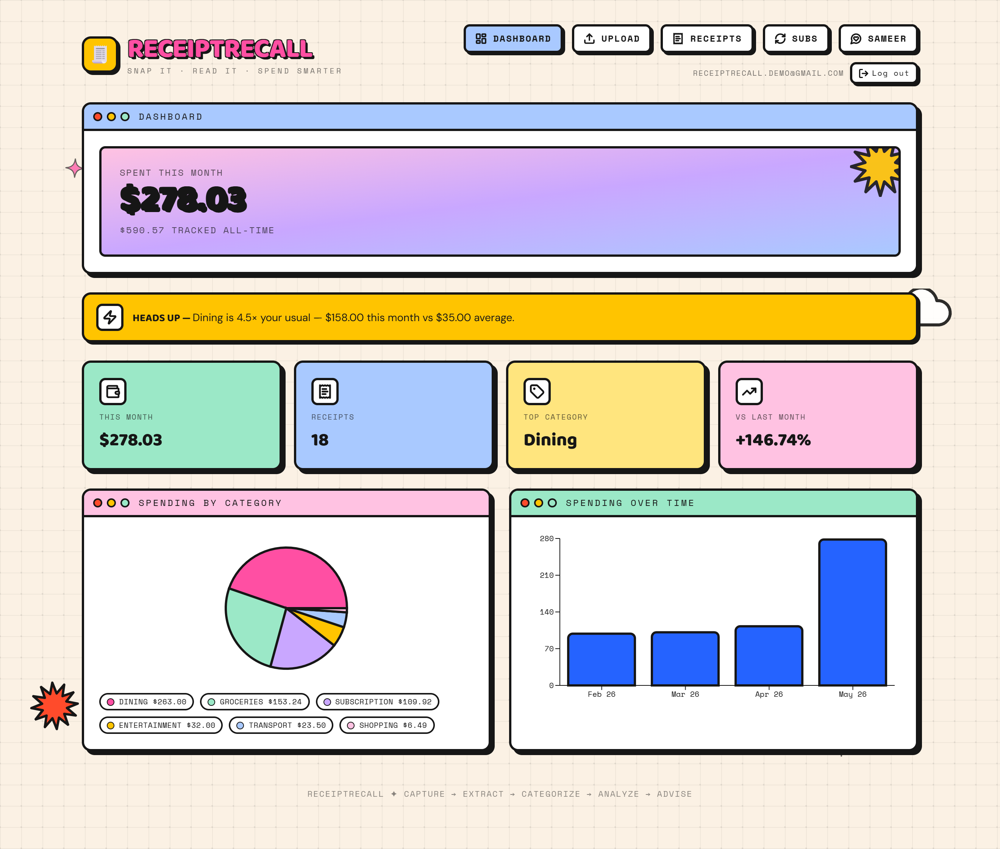
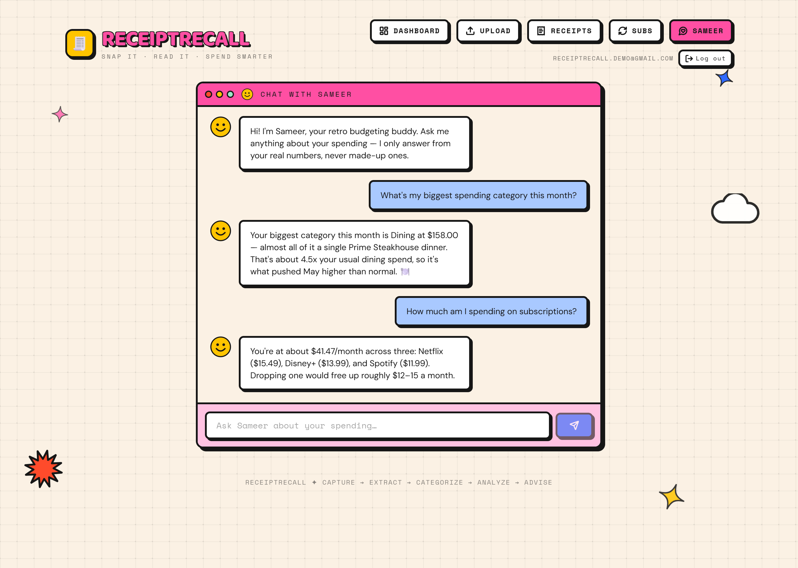
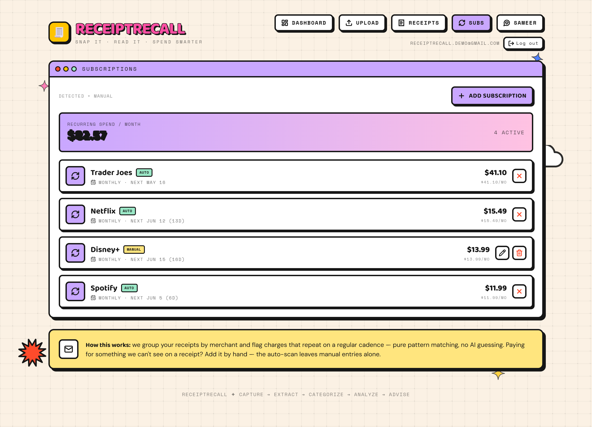
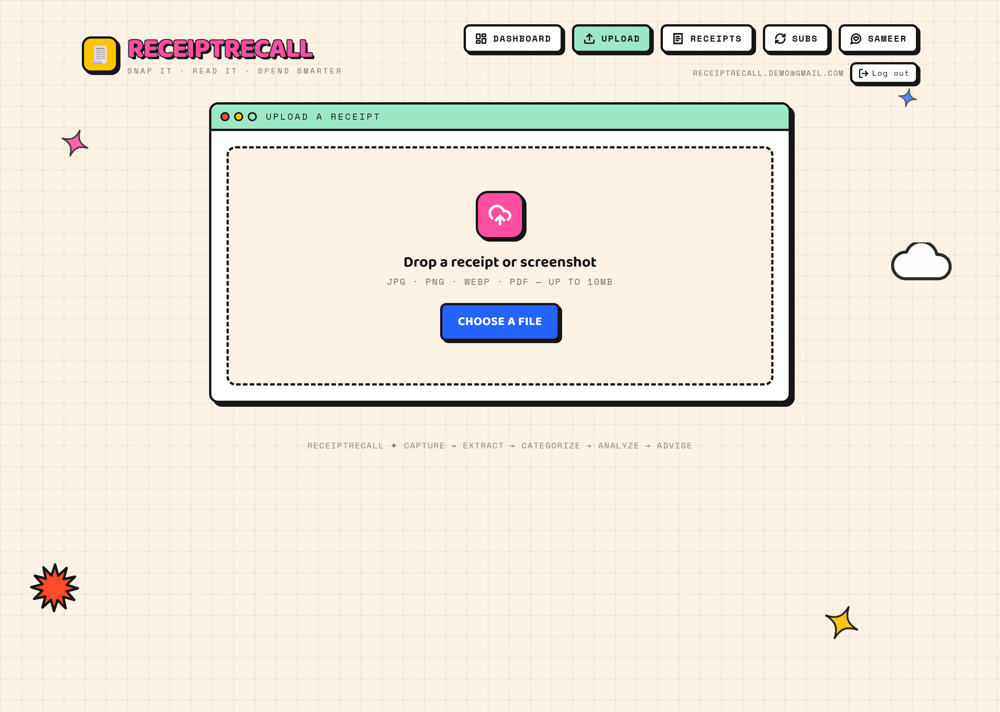
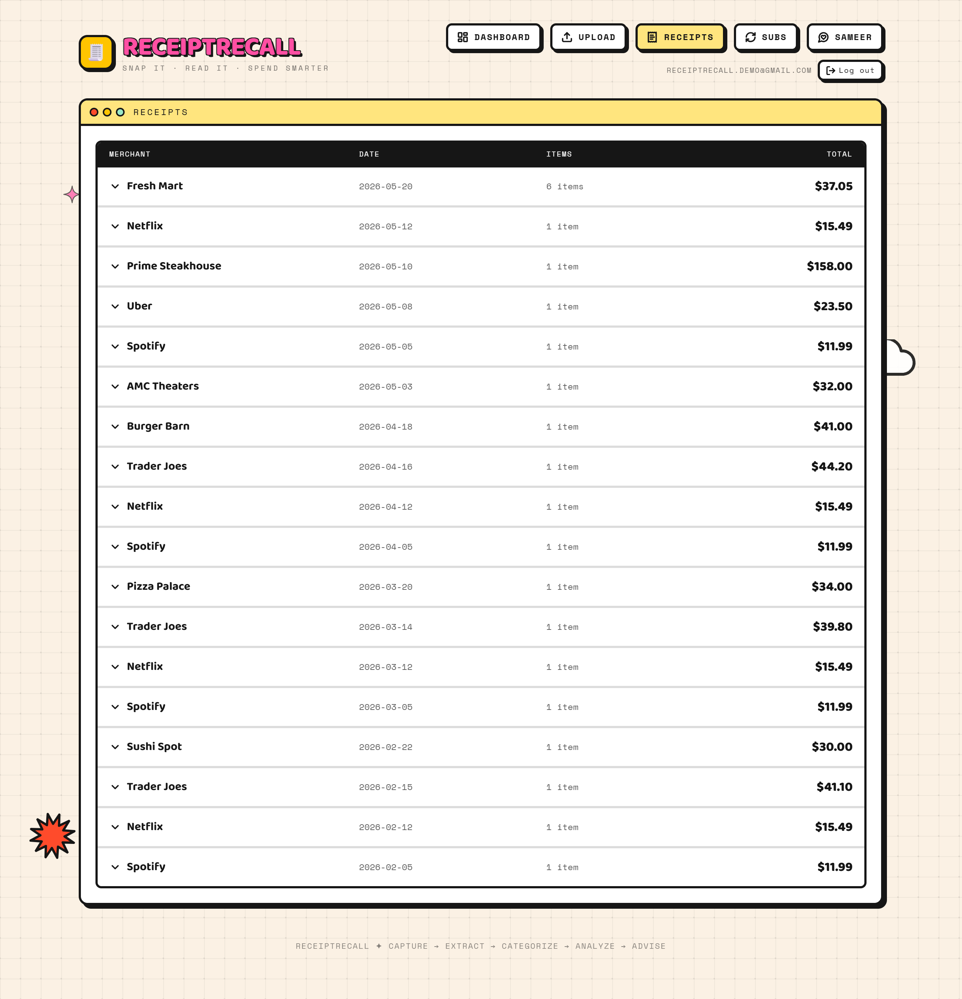

# ReceiptRecall 🧾✦

A personal spending tracker where the **input is a photo or screenshot, not manual typing**. Snap a receipt, drop a DoorDash screenshot, or upload an Amazon confirmation — a multimodal LLM reads it, extracts every line item with prices and tax, auto-categorizes it, and folds it into a running view of your spending. A retro chat assistant named **Sameer** answers questions grounded strictly in your real data.

**Core loop:** capture → extract → categorize → analyze → advise.

Built on a fully modern stack (React + TypeScript + Supabase + Gemini) wearing a bright **Y2K / vaporwave-pop** skin — thick black outlines, hard offset shadows, candy + pastel colors, retro browser windows. Retro-pop skin, modern engine.

**Live demo:** [receiptrecall.vercel.app](https://receiptrecall.vercel.app)

## Screenshots



| Sameer — the RAG assistant | Subscriptions — auto + manual |
|---|---|
|  |  |

| Upload & extract | Receipts |
|---|---|
|  |  |

---

## Stack

| Layer | Tech |
|---|---|
| Build / dev | **Vite**, **React 18**, **TypeScript** |
| Styling | **Tailwind CSS v4** — the entire Y2K-pop look is custom design tokens (`@theme` in `src/index.css`); no UI kit |
| Motion | **framer-motion** (springy buttons, twinkling sparkles, bouncing windows) |
| Icons | **lucide-react** (thick strokes to match the bold-outline look) |
| Backend | **Supabase** — Postgres, Auth, Storage, `pgvector` |
| LLM | **Google Gemini** — `gemini-2.5-flash` (vision + chat), `gemini-embedding-001` (768-dim embeddings) |
| Data | **TanStack Query** (fetching/caching), **Recharts** (charts), **date-fns** |
| Safety | **Zod** validates every LLM JSON response before it touches the DB |

## Architecture

```
Browser (React, RLS-scoped Supabase client)
  │
  ├─ Auth ............ Supabase email/password
  ├─ Storage ......... private "receipts" bucket, per-user folders
  ├─ Postgres ........ receipts, line_items, category_corrections,
  │                    subscriptions, chat_messages  (RLS on every table)
  │
  └─ Edge Functions (Deno, JWT-verified, hold the Gemini key as a secret)
       ├─ extract-receipt … image → structured JSON (Gemini vision)
       ├─ embed ............ text[] → 768-dim vectors (learning categorizer)
       └─ chat ............. question + user data → grounded answer (Sameer)
```

**The Gemini API key never reaches the browser.** All model calls go through Supabase Edge Functions that read the key from a server-side secret, so the client bundle stays clean.

## The AI/ML components (and why each is built the way it is)

**A) Receipt reading — multimodal extraction.** The uploaded image goes straight to Gemini (it reads images natively) with a strict JSON schema instruction. The response is parsed and **validated with Zod**; numbers are coerced from messy strings (`"$12.99"` → `12.99`), categories are clamped to the allowed set, and a `math_ok` check verifies `sum(line items) + tax ≈ total`. Low-confidence or math-mismatch reads route to a **human-in-the-loop review screen** before saving.

**B) Categorization that learns — `pgvector`.** Gemini assigns a category during extraction (zero-shot). When the user **corrects** one, the description is embedded (`gemini-embedding-001`) and stored in `category_corrections`. On future uploads, each incoming item is embedded and compared against past corrections with **cosine similarity** (a `match_category_correction` SQL function over `pgvector`); a close match applies the user's preferred category automatically. This learns each user's habits **with no model retraining.**

**C) Subscriptions & anomalies — deliberately NO LLM.** Recurring charges are found by grouping receipts by merchant and detecting a **regular cadence** (weekly / monthly / annual) with a **stable amount** (coefficient of variation ≤ 20%). Anomalies are **statistical outliers**: per category, the current month is flagged if it exceeds `mean + 2σ` of prior months. Choosing classical methods over an LLM here is intentional — it's cheaper, deterministic, and the right tool.

**D) Sameer — retrieval-augmented (RAG) assistant.** Sameer answers only from real numbers. The client retrieves the relevant rows (under RLS), distills them into a compact deterministic snapshot (category totals, monthly trend, subscriptions, anomalies, recent items), and sends that **plus** the question to Gemini. The system prompt forbids inventing figures and frames Sameer as an **informational budgeting helper, not a financial advisor**. Ask something the data can't answer and it says so instead of hallucinating.

## Security & scoping

- **Receipt/screenshot-based only** — never asks for or stores bank credentials or card numbers. This deliberate scoping removes a huge security burden by design.
- API keys live in **environment variables / Supabase secrets**, never committed (`.env` is git-ignored).
- **Row Level Security** on every table + storage bucket — users only ever touch their own rows/files (`auth.uid() = user_id`).
- Every LLM JSON response is **Zod-validated** before it touches the database.
- Edge Functions are **JWT-verified** — only signed-in users can invoke them.

## Build status

- [x] **Phase 0** — scaffold + retro-pop shell (design system, routing)
- [x] **Phase 1** — Supabase + email/password auth + schema + RLS
- [x] **Phase 2** — upload + Gemini extraction + Zod + math check + review screen
- [x] **Phase 3** — dashboard charts + self-improving categorizer (pgvector)
- [x] **Phase 4** — subscription detection (incl. manual add) + anomaly flags
- [x] **Phase 5** — the "Sameer" RAG assistant
- [x] **Phase 6** — polish, deploy config, docs

## Getting started

### 1. Frontend
```bash
npm install
cp .env.example .env     # fill in your Supabase URL + anon/publishable key
npm run dev
```

### 2. Database
Run [`supabase/schema.sql`](supabase/schema.sql) in the Supabase SQL Editor (creates tables, enables `pgvector`, RLS policies, the storage bucket, and the vector-match function).

### 3. Edge Functions
```bash
# one-time auth
export SUPABASE_ACCESS_TOKEN=...        # personal access token

# store the Gemini key server-side (never in the client)
npx supabase secrets set GEMINI_API_KEY=... --project-ref <your-ref>

# deploy all three functions
npx supabase functions deploy extract-receipt --project-ref <your-ref>
npx supabase functions deploy embed           --project-ref <your-ref>
npx supabase functions deploy chat            --project-ref <your-ref>
```

### 4. Deploy the frontend (Vercel or Netlify)
- Set env vars on the host: `VITE_SUPABASE_URL`, `VITE_SUPABASE_ANON_KEY`.
- SPA routing is handled by [`vercel.json`](vercel.json) (Vercel) and [`public/_redirects`](public/_redirects) (Netlify).
- Build command `npm run build`, output dir `dist`.

## Resume bullets this earns

- Built a full-stack AI spending tracker that extracts structured data from receipt/screenshot images using a multimodal LLM, with **Zod validation** and a **human-in-the-loop review flow** for low-confidence reads.
- Implemented a **self-improving categorization system** using vector embeddings (`pgvector`) that learns each user's preferences from corrections **without model retraining**.
- Designed **rule-based subscription and anomaly detection** (recurring-charge pattern matching + statistical outlier flagging) — deliberately choosing classical methods over an LLM where appropriate.
- Built a **retrieval-augmented (RAG)** chat assistant grounded strictly in the user's transaction data to eliminate hallucinated figures.
- Secured per-user data with Postgres **Row Level Security**, JWT-verified Edge Functions that keep the LLM key server-side, and a **credential-free, receipt-only** data model.
